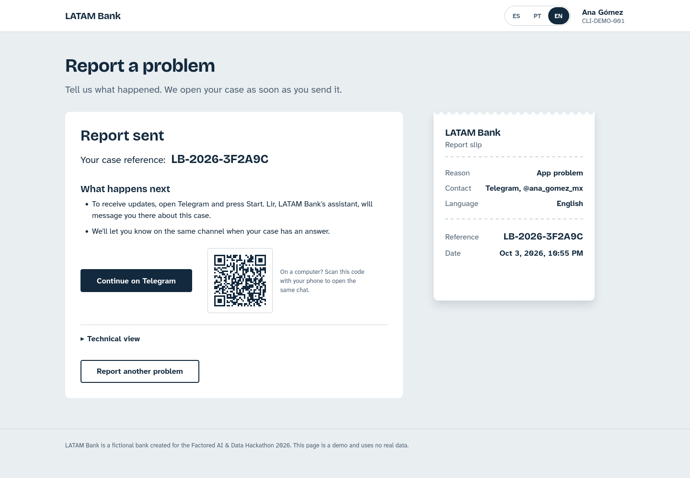
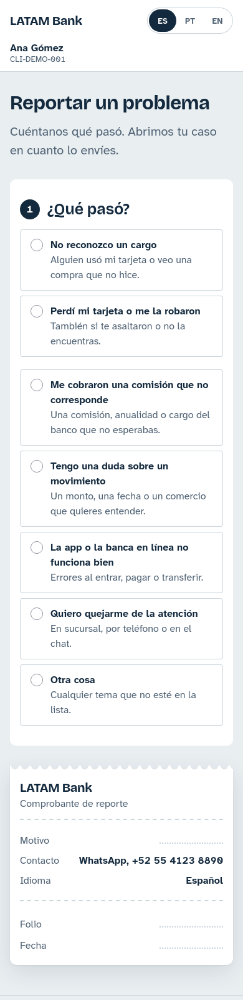
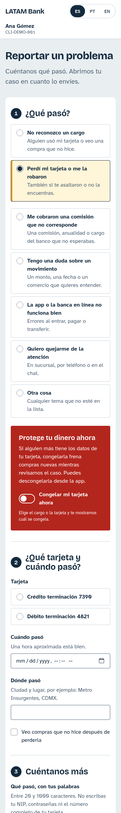
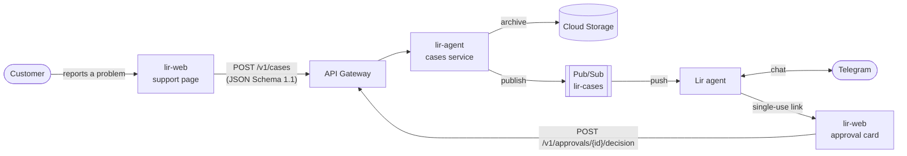

# lir-web

[](https://github.com/Lir-team/lir-web/actions/workflows/deploy.yml)

The customer-facing support page of **LATAM Bank**, the synthetic bank of the
Factored AI & Data Hackathon 2026. A signed-in customer reports a problem (an
unrecognized charge, a lost or stolen card, a wrong fee), and the page turns it
into a validated, versioned case for **Lir**, the bank's support agent. The
conversation then continues on Telegram, and any sensitive action Lir proposes
comes back to the customer as an approval card.


| Telegram hand-off | Mobile | Lost card, mobile |
| --- | --- | --- |
|  |  |  |

## Highlights

- **The charge is the evidence.** For a fraud report the customer picks the
  charge from their statement instead of typing amounts, so the agent gets the
  exact `transaction_id` it can verify.
- **A contract, not just a form.** Every case is built against a JSON Schema
  (`schema_version` 1.1), sent with an `Idempotency-Key`, and documented down
  to its Pub/Sub attributes in [`docs/case-contract.md`](docs/case-contract.md).
  This repo defines what the backend accepts.
- **Urgency changes the page.** Fraud reasons raise an alert that offers to
  freeze the card, and the case carries a priority hint (`critical` for a lost
  card or a large or foreign fraudulent charge).
- **Human in the loop.** Lir never acts on the customer's behalf (opening a
  dispute, for example) without an explicit decision on the approval card,
  tied to a hash of the exact content the customer saw.
- **Three languages.** Spanish, Brazilian Portuguese and English, with a test
  that keeps the dictionaries in step.
- **No framework, no build.** Plain HTML, CSS and ES modules. The business
  logic lives in DOM-free modules covered by 78 tests on Node's built-in runner.

## How it fits in Lir



| Repository | Role |
| --- | --- |
| `lir-web` (this repo) | Support page, approval card, and the case contract |
| `lir-agent` | Cases and approvals API, and the Lir agent |
| `lir-infra` | Terraform for the Google Cloud infrastructure |

## Quick start

You need Python 3 (or any static file server) and Node 18 or later for the
tests. There is nothing to install.

```sh
python3 -m http.server 5500   # then open http://localhost:5500/
npm test                      # 78 tests, Node's built-in runner
```

Serve the folder over HTTP, since ES modules do not load from `file://`. Port
5500 matters: it is the only origin the lir-agent API allows through CORS.

By default the page sends cases to a local lir-agent API on port 8080 (see that
repository's README). To try the page on its own, use **demo mode**: create
`js/config.local.js` with `window.LIR_CONFIG = { casesEndpoint: null };`. The
request is then simulated, and the confirmation shows the case reference and
the exact payload a backend would receive.

Handy links:

- `?reason=unrecognized_charge` opens the form with a reason already picked.
- `?lang=pt` or `?lang=en` picks the language. The switch in the top bar
  remembers the choice.

## Configuration

`js/config.js` sets `window.LIR_CONFIG`. Values in the git-ignored
`js/config.local.js`, loaded first, take precedence.

| Key | Default | Purpose |
| --- | --- | --- |
| `casesEndpoint` | `http://localhost:8080/v1/cases` | URL of `POST /v1/cases`. `null` turns on demo mode. |
| `apiKey` | `null` | API Gateway key, sent as `?key=`. The local API needs none. |
| `approvalsEndpoint` | `http://localhost:8080/v1/approvals` | Base URL for the approval card. |
| `transactionsEndpoint` | `http://localhost:8080/v1/me/transactions` | The signed-in customer's statement. Used only when `authToken` is also set. |
| `authToken` | `null` | Customer JWT, sent as `Authorization: Bearer`. Sign-in is mocked, so it is issued outside this repo. |

Without a token, or when the statement request fails (an expired sign-in, for
example), the page keeps the bundled demo customer. Cards and contact details
are not in the hackathon dataset, so they stay simulated.

### Pointing a local page at the deployed API

```sh
cp js/config.local.example.js js/config.local.js
# in lir-infra:
terraform output                      # the API Gateway host
terraform output -raw cases_api_key   # the API key
```

Fill in the gateway host and the key, then serve on port 5500 as above. Never
commit `js/config.local.js`, since the key is a secret.

## The approval card

`aprobar.html` is where the customer approves or rejects an action Lir wants to
take for them. The agent sends a single-use link by chat:
`aprobar.html?id=APR-...&t=<token>`.

- The page reads the request from `GET {approvalsEndpoint}/{id}` with the
  token in `X-Approval-Token`, shows it in the customer's language, and posts
  the decision with the `content_hash` of what it displayed. A decision always
  refers to that exact content.
- The token is handled as a credential. It is removed from the address bar on
  load and never sent as a `Referer`, and every value from the server is
  written with `textContent`.
- Spent, wrong or expired links, requests decided elsewhere and network
  failures each get their own message. Only a network failure can be retried.
- When the agent requires step-up sign-in, every call carries the customer's
  JWT, and a missing sign-in, or someone else's, gets its own screen.

## Case contract

The page sends a versioned JSON case to `POST /v1/cases`, keyed by a client
UUID. Seven categories map to the agent's intents:

| Category | Intent hint | Fraud |
| --- | --- | --- |
| `unrecognized_charge` | `cargo_no_reconocido` | yes |
| `card_lost_stolen` | `cargo_no_reconocido` | yes |
| `improper_fee` | `cobro_indebido` | no |
| `transaction_inquiry` | `consulta_movimiento` | no |
| `app_issue`, `service_complaint` | `otra_queja` | no |
| `other_request` | `fuera_de_alcance` | no |

The full contract is in [`docs/case-contract.md`](docs/case-contract.md):
headers, error shape, the Telegram start link, the Pub/Sub hand-off with a
per-customer ordering key, and the CORS rules. The payload schema is
[`schema/case.schema.json`](schema/case.schema.json) (JSON Schema 2020-12).

## Quality

- **Tests:** `npm test` runs 78 tests on Node's built-in runner. They cover
  payload building, schema conformance, submission and error mapping, the
  statement loader, the approval flow, the Telegram hand-off, the QR code and
  i18n parity. The core modules (`js/core/`) never touch the DOM, which keeps
  them easy to test.
- **CI/CD:** every push to `main` runs the tests on Node 22 and then deploys.
- **Accessibility:** the page uses semantic form controls with ARIA labelling,
  a visible focus ring, and layouts for both desktop and mobile.
- **Safe rendering:** server data reaches the page through `textContent`,
  never through HTML strings.

## Deployment

The page runs on Cloud Run as an nginx image serving the static files on port
8080 ([`Dockerfile`](Dockerfile), [`deploy/nginx.conf`](deploy/nginx.conf)).
At start-up, [`deploy/40-lir-config.sh`](deploy/40-lir-config.sh) writes
`js/config.js` from the environment, so a single image serves every
environment.

| Variable | Sets |
| --- | --- |
| `LIR_CASES_ENDPOINT` | `casesEndpoint` (unset means demo mode) |
| `LIR_API_KEY` | `apiKey` |
| `LIR_APPROVALS_ENDPOINT` | `approvalsEndpoint` |
| `LIR_TRANSACTIONS_ENDPOINT` | `transactionsEndpoint` |
| `LIR_AUTH_TOKEN` | `authToken` |

[`.github/workflows/deploy.yml`](.github/workflows/deploy.yml) runs the tests,
authenticates to Google Cloud through Workload Identity Federation (no
long-lived keys), pushes an image tagged with the commit SHA to Artifact
Registry, and deploys it. A manual build path through Cloud Build is in
[`deploy/cloudbuild.yaml`](deploy/cloudbuild.yaml).

## Project structure

```
index.html          support page
aprobar.html        approval card
css/                design tokens, layout, form and case-slip styles
js/
  core/             DOM-free logic: case rules, payload, submit, statement, approval
  ui/               rendering, form state, errors, case slip, success screen
  i18n/             es, pt and en dictionaries
  data/             demo customer
  vendor/           QR code generator (MIT)
schema/             JSON Schema for the case payload
tests/              node --test suites
docs/               case contract, design plan, screenshots
deploy/             nginx config, runtime config script, Cloud Build file
odd/tasks/          feature task documents
```

## Design

The page is built around a **case slip**, a receipt that sits beside the form,
fills itself in as the customer answers, and gets its case number and timestamp
on submit, like a stamped bank voucher. The palette uses a single accent color,
alert red appears only on the fraud path, and the copy is plain and in active
voice. The reasoning, tokens and revisions are in
[`docs/design-plan.md`](docs/design-plan.md).

## Credits

- QR codes: [qrcode-generator](https://github.com/kazuhikoarase/qrcode-generator)
  by Kazuhiko Arase, vendored unchanged as `js/vendor/qrcode.js` (commit
  `64f5976`, MIT, see `js/vendor/qrcode.LICENSE`).
- Visual direction: Anthropic's `frontend-design` skill, kept under
  `.claude/skills/frontend-design/` (Apache-2.0, see its `LICENSE.txt`).
