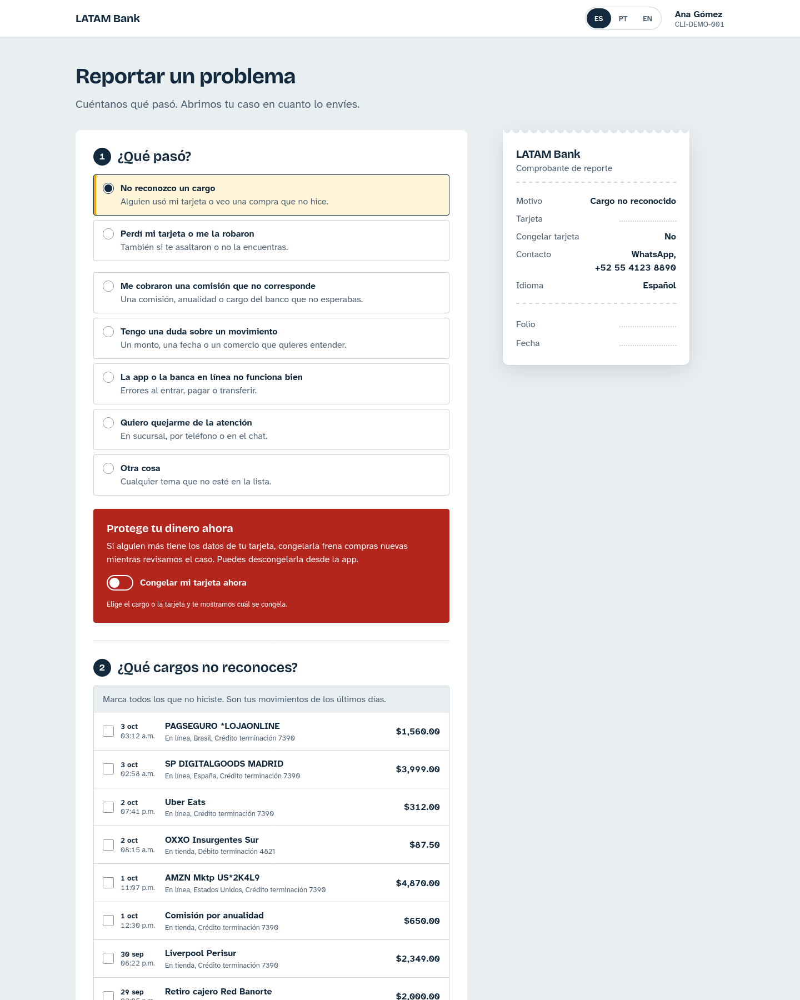

# lir-web

The customer-facing support form of **LATAM Bank**, the synthetic bank of the
Factored AI & Data Hackathon 2026. A signed-in customer reports a problem
(an unrecognized charge, a lost or stolen card, a wrong fee, and so on), and
the page sends a versioned case payload to the bank's API, which hands it to
the Lir agent. When the customer picks Telegram, the confirmation offers a
"Continue on Telegram" button (and a QR code on wide screens) so they can open
the chat with Lir.

It is plain HTML, CSS and JavaScript: no framework, no bundler, no npm
dependencies. This repo defines the contract the backend (the `lir-agent`
repo, behind Google API Gateway) accepts.



More screenshots: [desktop](docs/screenshots/desktop.png),
[Telegram hand-off](docs/screenshots/success-telegram.png),
[Telegram hand-off, mobile](docs/screenshots/success-telegram-mobile.png),
[mobile](docs/screenshots/mobile.png),
[mobile, lost card](docs/screenshots/mobile-lost-card.png).

## Run it

ES modules do not load from `file://`, so serve the folder with any static
server. Use port 5500: the lir-agent API runs on 8080 and only allows the
`http://localhost:5500` origin (`CORS_ORIGINS` in its `.env`).

```sh
# Terminal 1: the lir-agent API on :8080 (see that repo's README)

# Terminal 2: web on :5500
cd ../lir-web && python3 -m http.server 5500
```

Then open <http://localhost:5500/>.

## Test it

The pure logic modules do not touch the DOM, so Node's built-in test runner
covers them (Node 18 or later, nothing to install):

```sh
node --test tests/
```

Useful links while demoing: `?reason=unrecognized_charge` preselects a reason,
and `?lang=pt` or `?lang=en` picks the language (the switch in the top bar
remembers the choice).

## Configure it

`js/config.js` sets `window.LIR_CONFIG`:

- `casesEndpoint`: the URL of `POST /v1/cases`. The default,
  `http://localhost:8080/v1/cases`, is the local lir-agent API; a deployment
  points it at the API Gateway. Set it to `null` for demo mode: the page
  simulates the request and shows a reference number and the payload, with no
  Telegram button.
- `approvalsEndpoint`: the base URL of `/v1/approvals`, used by the approval card. The
  default, `http://localhost:8080/v1/approvals`, is the local lir-agent API.
- `authToken`: the customer JWT the gateway checks, sent as
  `Authorization: Bearer <token>`. Sign-in is mocked in this demo, so the token
  is issued outside this repo. `null` sends no `Authorization` header.

## Approval card

`aprobar.html` is where a customer approves or rejects an important action the bank
would take on their behalf (opening a dispute today). Nothing runs without that approval.
The lir-agent sends the customer a single-use link to it, by chat or Telegram button:
`aprobar.html?id=APR-...&t=<token>`.

- The page reads the request from `GET {approvalsEndpoint}/{id}` with the token in the
  `X-Approval-Token` header, shows it (title and details, in the customer's language) and
  sends the decision to `POST {approvalsEndpoint}/{id}/decision` with the `content_hash` of
  the card it showed, so a decision always refers to that exact content.
- The token is a credential: the page removes it from the address bar on load, sends no
  `Referer`, and writes every value with `textContent`.
- A spent, wrong or expired link, a request decided elsewhere and a network failure each get
  their own message. Only a network failure can be retried.
- Step-up: when the agent requires the bank's sign-in for approvals, the page sends the
  customer's JWT (`authToken`) with every call, and a missing or someone else's sign-in gets
  its own screen.
- `js/core/approval.js` has no DOM access; `tests/approval.test.js` covers it.

## Backend contract

The page sends a versioned JSON case to `POST /v1/cases` with an
`Idempotency-Key`. The endpoint, error shape, Telegram Start link,
category-to-intent mapping, the Cloud Storage hand-off to the agent and the
CORS rules are in
[`docs/case-contract.md`](docs/case-contract.md); the payload schema is
[`schema/case.schema.json`](schema/case.schema.json).

## Languages

Spanish (default), Brazilian Portuguese and English live in `js/i18n/`. A test
checks that the three dictionaries have the same keys and placeholders.

## Folder layout

```
index.html          page shell
css/                tokens, base layout, form and slip styles
js/                 app entry, config, UI modules, pure core logic, i18n
tests/              node --test suites for the pure modules
docs/               design plan, backend contract, screenshots
schema/             JSON Schema for the case payload
odd/tasks/          feature task document
```

## Credits

The QR code on the confirmation screen is drawn with
[qrcode-generator](https://github.com/kazuhikoarase/qrcode-generator) by
Kazuhiko Arase, vendored unchanged as `js/vendor/qrcode.js` (`js/dist/qrcode.js`
at commit `64f5976`) under the MIT license (see `js/vendor/qrcode.LICENSE`).

The visual direction follows Anthropic's `frontend-design` skill, kept
under `.claude/skills/frontend-design/` and licensed under Apache-2.0 (see
the `LICENSE.txt` next to it). The design decisions for this page are in
[`docs/design-plan.md`](docs/design-plan.md).
